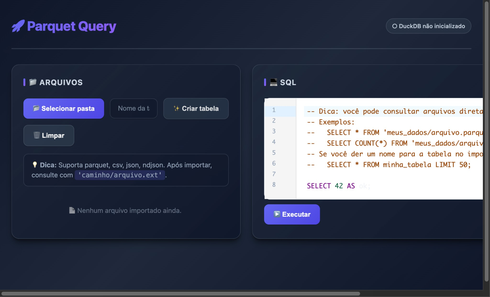

# Parquet Query (React + DuckDB)

App React no browser usando DuckDB-WASM para importar uma pasta (parquet/csv/json/ndjson) e executar queries SQL.



## Requisitos

- Node.js 18+
- Navegador Chromium (Chrome/Edge) recomendado para **selecionar pasta** via File System Access API
  - Em outros navegadores, o app usa fallback via `<input webkitdirectory>`

## Como rodar

```bash
npm install
npm run dev
```

Abra a URL mostrada pelo Vite.

## Como usar

1. Clique em **Selecionar pasta** e escolha uma pasta com arquivos (`.parquet`, `.csv`, `.json`, `.ndjson`)
2. (Opcional) Preencha **Nome da tabela** para criar uma VIEW com **todos os `.parquet`** importados
3. Rode queries consultando os arquivos diretamente pelo caminho importado ou pela tabela:

```sql
SELECT * FROM 'minha_pasta/arquivo.parquet' LIMIT 50;
SELECT COUNT(*) FROM 'minha_pasta/arquivo.csv';
SELECT COUNT(*) FROM minha_tabela;
```

## Observações

- O DuckDB-WASM (worker/wasm) é baixado do jsDelivr na primeira vez (precisa de internet).
- Os arquivos são carregados para a memória do browser (evite pastas muito grandes).
- A UI mostra no máximo 200 linhas por query.
